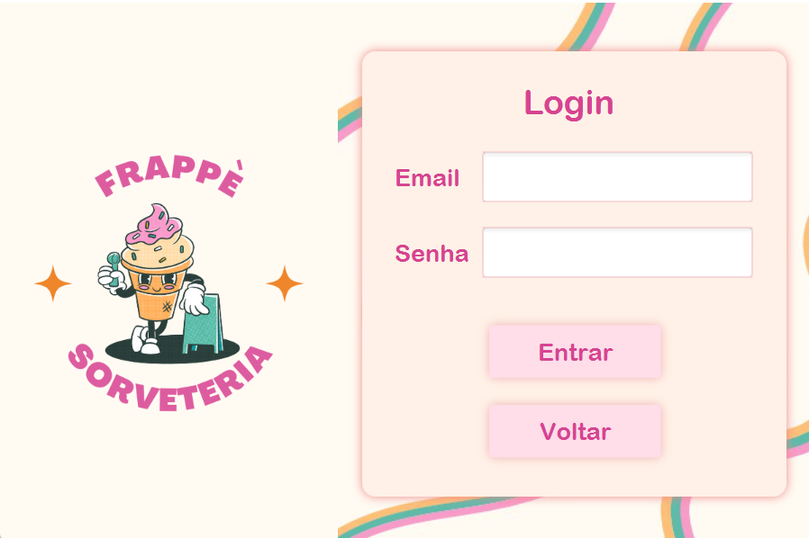

# Sistema para Sorveteria 🍦

[Tecnologias](#Tecnologias) • [Aplicabilidades](#Aplicabilidades) • [Desenvolvedores](#Desenvolvedores)

##### Um sistema para coordenar os pedidos de uma sorveteria. Este projeto foi desenvolvido e apresentado para a disciplina de Programação Orientada a Objetos.

## Tecnologias
- `Java`
- `InteliJ IDEA`
- `Paradigma de orientação a objetos`
- `JavaFX`
- `SceneBuilder`

## Aplicabilidades

### Cliente
- **Logar no sistema:** O cliente entra com e-mail e senha cadastrados para fazer pedidos.
- **Alterar endereço:** O cliente pode escolher um local preferido para a entrega.
- **Acompanhar pedido:** O cliente pode acompanhar o *status* do pedido em tempo real.
- **Cancelar pedido:** O cliente pode cancelar o pedido que não saiu para ser entregue.
  
  
  
  

### Entregador
- **Entregar o pedido:** O entregador possui acesso aos pedidos confirmados e deve mudar o *status* para `entregando`.
- **Concluir o pedido:** O entregador deve mudar o *status* do pedido para `concluído` ao finalizar a entrega.

  
  
### Administrador
- **Alterar o estoque:** O Administrador pode atualizar o estoque da sorveteria.
- **Adicionar sabores:** O Administrador pode adicionar sabores ao cardápio.
- **Acessar os pedidos:** O Administrador tem acesso à lista de pedidos e seus respectivos *status*.
- **Cadastrar entregadores:** O Administrador pode cadastrar e remover entregadores do sistema da sorveteria.

  
  
  
  

## Desenvolvedores
Este projeto foi criado com 🤍 por:
- 
  
  
